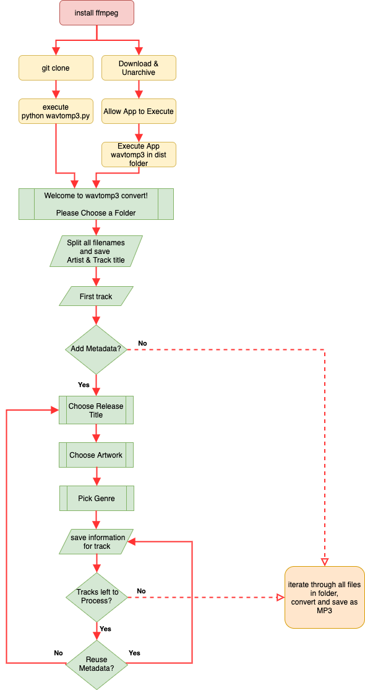

# wavtomp3

## Converts a choosen folder with wav files into an mp3
### Optionally will also save additional metadata to the mp3 like Artwork, Release Title and Genre

### Packages used
- id3 tags: https://github.com/nicfit/eyeD3
- conversion: https://github.com/jiaaro/pydub

<a name="prereqs"/></a>
### Prereqs
the pydub package uses <b>ffmpeg</b> for the conversion, so you'll <b>need to install</b> it:

- [mac](https://github.com/fluent-ffmpeg/node-fluent-ffmpeg/wiki/Installing-ffmpeg-on-Mac-OS-X)
- [windows](https://windowsloop.com/install-ffmpeg-windows-10/)
- [linux](https://linuxize.com/post/how-to-install-ffmpeg-on-debian-9/)

### Default settings
- files are expected in format "artist - tracktitle.wav"
- the file name will be used as minimal configuration metadata for the id3 tags
- bitrate is hard coded to 320k
- files will be exported to the same directory as the wav file location
- Default genre when choosing Metadata is Drum & Bass (because I like it ;-))

### Download, Execute App (MacOS)
 
1. [Install FFMPEG](#prereqs) 
2. [Download & Unarchive wavtomp3](#download_unarchive)  
3. [Allow App to Execute](#allow_app)  
4. [Execute App wavtomp3](#execute_app)

### App Flow



1. [Choose Folder](#choose_folder)  
2. [Add Metadata (Yes/No)](#add_metadata) 

### Metadata Yes

- [Choose Release Title](#choose_title)
- [Choose Artwork](#choose_artwork) 
- [Pick Genre](#pick_genre) 

Next wav file will be processed...

#### Reuse Metadata (Yes/No)
- <ins>Yes</ins> > Repeat until all files processed then [Convert & Save MP3](#convert)
- <ins>No</ins> > Start Metadata process again see: [Reuse Metadata](#reuse)

### Metadata No
 
3. [Convert & Save MP3](#convert)
4. [Result](#result)
5. [Undo allowing App to Execute](#undo)
  
<a name="download_unarchive"/></a>
#### Download & Unarchive


<a name="allow_app"/></a>
#### Allow App to Execute

```bash
sudo spctl --master-disable
```


<a name="execute_app"/></a>
#### Execute App


<a name="choose_folder"/></a>
#### Choose Folder


<a name="add_metadata"/></a>
#### Add Metadata (Yes/No)

Choose "No" to immediately start conversion and save the mp3


<a name="choose_title"/></a>
##### Release Title


<a name="choose_artwork"/></a>
##### Choose Artwork


<a name="pick_genre"/></a>
##### Pick Genre


<a name="reuse"/></a>
##### Reuse Metadata (Yes/No)

You will be asked if you want to reuse the metadata for each track. If any of the above Metadata changes, choose "No" and go through the same process again.


<a name="convert"/></a>
### Convert & Save MP3


<a name="result"/></a>
### Result


<a name="undo"/></a>
### Don't forget to undo your changes for the executable

```bash
sudo spctl --master-enable
```
